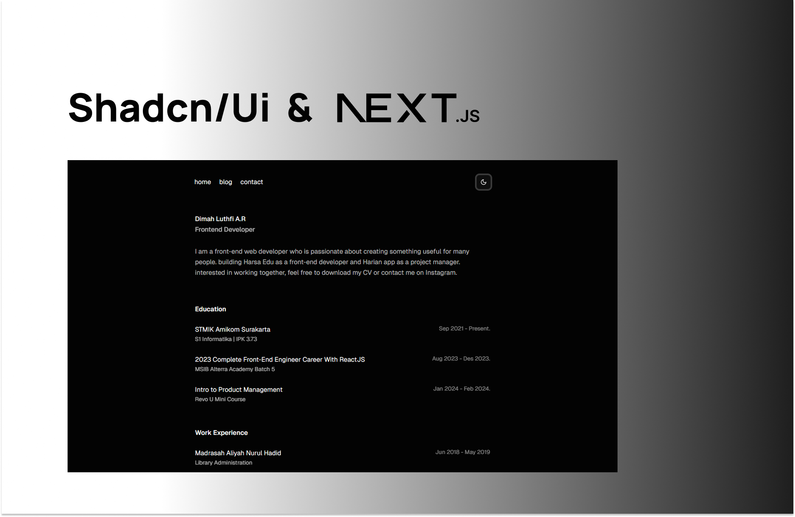

# **Build your portfolio with shadcn/ui & next.js**

View the [demo here]().



# **Getting started**

Portfolio was built with [Shadcn/ui](https://ui.shadcn.com/) and [Next.js](https://nextjs.org).

**1. Clone the repository**

```
git clone https://github.com/dimdimah/dimah-com.git
```

**2. Install dependencies**

```
npm install
```

**3. Run dev server**

```
npm run dev
```

**5. Edit content**

```
src/data/home.js & src/data/social.js
```

# **Features**

## **Shadcn/ui**

- All components & features of [Shadcn/ui](https://ui.shadcn.com/)

## **Design**

- Responsive layout optimized for all screen sizes
- support dark mode feature by [Tailwindcss v4](https://tailwindcss.com/docs/dark-mode)

# **Authors**

Connect with me on Instagram or LinkedIn.

Dimdim: [Instagram](https://www.instagram.com/dim.dimmm_/), [LinkedIn](https://www.linkedin.com/in/dimah-luthfi/)
